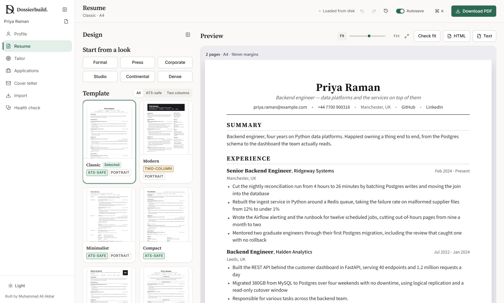
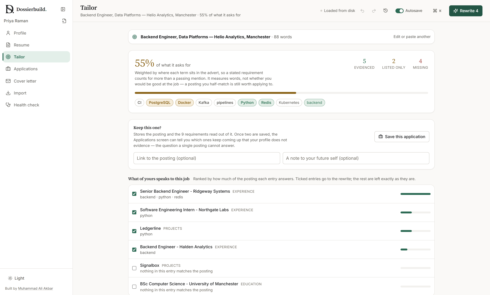
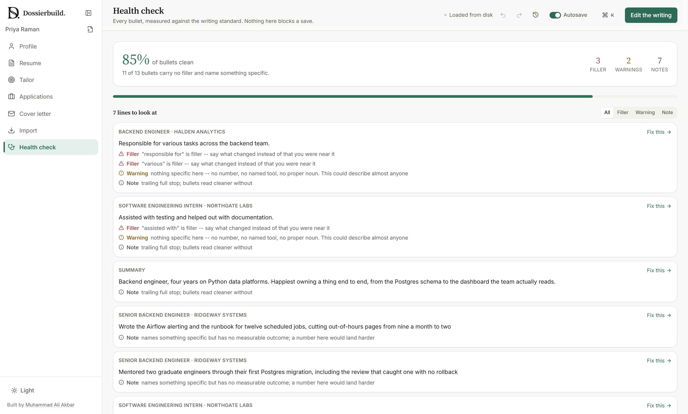

# Dossierbuild

[](https://github.com/aliakbarkhan21/Dossierbuild/actions/workflows/checks.yml)

An AI-assisted resume builder that runs on your own machine. You keep one
complete master profile of everything you have done; each application gets a
version re-angled at that job, printed to a real PDF, and filed against the
posting it went to.

Nothing leaves your computer except the text you explicitly send to a model,
and the two things that would be most tempting to hand a model — reading a job
posting, and scoring your writing — are done by rules instead, so they work
with no API key at all.

**Version 2.0** — edit the resume on the resume itself, sections the app has
no name for, bold/italic/underline, per-CV design, ten templates, and a Review
screen that reads the document rather than one line at a time. See
[CHANGELOG.md](CHANGELOG.md) for what changed and why.

> **This repository contains no one's resume.** `data/` and `.env` are ignored
> by git — deny-by-default, not a list of filenames — so a clone starts empty
> and the first run offers a worked example built from a fictional person.
> Your profile, portrait, saved versions, API key and database never leave
> your own machine.



---

## What is different about it

Most resume tools hand your history and the job advert to a model together and
print whatever comes back. Three things here are deliberately not that.

**The model is never asked what the job requires.** `core/jobspec.py` reads
the posting by rules — a technology lexicon, structural shapes, and your own
declared vocabulary — weights each term by where it sits in the advert, and
scores your profile against the result. So the gap analysis is deterministic,
testable, and works with **no API key at all**. Only the rewriting step uses a
model, and it is handed the analysis rather than the advert.



**A rewrite cannot add facts, and the check is a diff rather than a prompt.**
Every suggestion is compared against the bullet it came from: any number, tool
or employer that appears in neither the source nor anywhere else in your
profile is flagged, and flagged suggestions arrive **unticked**. The posting's
own vocabulary is deliberately excluded from what counts as known — a letter
that picks up "Kubernetes" from the advert gets caught rather than waved
through. The Applications screen then reports how often the audit fired and
how often you accepted a flagged line anyway, because a guard nobody can see
firing is a guard nobody should trust.

**The writing standard is code, and the same code judges the model's output.**
`core/quality.py` is a bullet linter — filler phrases, and a specificity check
that reads the skills and technologies *you* entered rather than a fixed list.
It never blocks a save. It is also what every AI rewrite is run through, so a
suggestion that trades one kind of filler for another shows up as a score that
did not move.



---

## What it does

**Seven screens, and each does one thing.** (The interview brief is a
sheet inside Applications rather than a screen of its own.)

| | |
| --- | --- |
| **Profile** | Every role, project, degree, skill, certification, honour and achievement. Drag or arrow-key to reorder entries, sections and bullets. Autosaves, with a timestamped backup on every write. |
| **Resume** | Pick a look, watch the page, print it. The preview is the printed document, not an approximation of it. |
| **Tailor** | Paste a posting. It is read by rules — no model — into weighted requirements, then scored against your profile. Only the rewrite step uses a model, and every rewrite is diffed against its source. |
| **Applications** | Every posting you saved, what stage it is at, and — across all of them — which requirements you keep failing to evidence. |
| **Import** | LinkedIn's data export, a PDF, a DOCX, or pasted text, all landing on the same review screen. |
| **Cover letter** | One letter per application, drafted from the requirements your profile can evidence and set in the resume's own typeface. |
| **Interview brief** | On any application at interview stage: what you can evidence, what you cannot, the questions each invites, and a scratchpad. Rules only — no model, no network. |
| **Review** | The document and every line in it: a job that ends before it starts, a resume with no email on it, the same bullet pasted twice -- and every line measured against the writing standard, with the one to fix. |

**Design, curated rather than open-ended.** Ten templates × four body
layouts, six accent colours, nine type pairings, six paper sizes, three margin
widths, three line spacings, five type sizes, two date formats, and per-resume
section order and visibility. Six named looks apply four coherent
combinations each — twenty-four designs in two clicks. There is no colour
picker, because the difference between a good resume and a bad one was never
the particular blue.

**More than one CV, when one genuinely will not do.** One master profile is
still the default, and focus tags are still the right answer to "the same
facts, aimed at a different job". But a research post and a support role are
two different accounts of a life, not one document tailored twice — so the
sidebar switches between CVs, each a profile file of exactly the same format.
The design, the applications, the saved versions and the letters are shared:
those are a record of a job search, not of a document. Starting one asks
nothing, because the one you were on is already written to disk.

**A saved version is the document you actually sent.** Profile and design
together, because a resume is both: the same words at 92% type with tight
margins are one page and at 108% they are two. Six weeks later you can read
and reprint exactly what an employer saw, however far the profile has moved
on.

**Undo covers everything.** One history for the profile and the design, so
Ctrl+Z after changing a template undoes the template. A run of typing is one
step, not fifty. There is a history panel you can point at.

**One profile, several job families.** Tag a bullet or a skill group
`#backend` or `#frontend`, then set a focus on the resume: tagged lines print
only under their own focus, and untagged lines print always. A targeted resume
without a second profile to keep in step.

**Nothing to type on the first run.** An empty profile offers three ways out —
import one, load a worked sample, or start clean. The sample is written to the
standard the app teaches and scores 85% on the Health screen, with two
deliberately weak bullets so the check has something real to catch.

---

## Running it

```bash
pip install -r requirements.txt
python -m playwright install chromium      # the PDF pipeline needs a browser
cd web && npm install && npm run build     # the interface, built to web/dist
cd .. && python -m uvicorn dossier.api:app --port 8000
```

Then open <http://localhost:8000>. One process serves both the API and the
interface, so a machine running Dossierbuild needs Python and Chromium but no
Node.

On Windows, `scripts/launch.vbs` does all of that window-less and opens the
browser once the port answers — it is what the desktop shortcut runs. There is
no stop script: the page heartbeats while it is open, and the server exits a
few seconds after the last tab closes.

While working on the frontend, run Vite instead for hot reload:

```bash
cd web && npm run dev      # 5173, proxying /api to 8000
```

A Gemini key is optional and buys three things: parsing an imported resume,
rewriting bullets for a posting, and drafting a single line on request.
Everything else — the posting analysis, the coverage score, the writing
standard, every template, the PDF — works without one.

```bash
cp .env.example .env      # then paste your key into it
```

Get a free key at [aistudio.google.com/apikey](https://aistudio.google.com/apikey).

### In a container

```bash
docker build -t dossierbuild .
docker run -p 8000:8000 -v "$PWD/data:/data" -e GEMINI_API_KEY=... dossierbuild
```

### Checks

```bash
pip install -r requirements-dev.txt
pytest                            # 213 checks, about 90 seconds (real PDFs)
cd web && npm test                # 25 checks on the undo stack and the API client
```

Or without pytest — each script runs on the app's own dependencies:

```bash
python scripts/check_phase1.py    # schema, storage, id stability, migration   (20)
python scripts/check_import.py    # LinkedIn export, extraction, merge         (21)
python scripts/check_phase2.py    # design, templates, PDF and its text layer  (20)
python scripts/check_db.py        # the schema, its constraints, its queries   (19)
python scripts/check_tailor.py    # the posting reader and the audit           (29)
```

The render checks print real PDFs, so they need Chromium.

---

## How it is built

```
dossier/
  core/      the product, with no interface attached
    schema.py        the master profile contract (Pydantic v2). Facts only.
    storage.py       load / validate / atomic save / migrate
    quality.py       the bullet-writing standard, as code
    jobspec.py       a posting, read by rules: weighted terms, coverage, evidence
    db.py            SQLite: connection, pragmas, its own migration chain
    applications.py  saved applications, and the queries across all of them
    versions.py      what was actually sent: profile + design, kept whole
    letters.py       cover letters, filed against the application they answer
    interview.py     the pre-interview brief, by rules over the posting
    sample.py        the worked example, written to the standard it teaches
    ids.py           stable short ids
    cvs.py           more than one CV in one data directory
  ingest/    PDF · DOCX · LinkedIn -> profile, plus the merge review. No AI.
  ai/        every call that leaves this machine for a model
    client.py        the key, the model fallback ladder, the retry budget
    parse.py         resume text -> profile. Transcribes, never composes.
    tailor.py        profile + posting -> rewrites keyed by block id, each audited
    suggest.py       one drafted bullet or summary, from facts you supply
    letter.py        a cover letter, briefed by the rules-based posting read
  render/    profile + design -> HTML -> PDF
    design.py        every presentation choice, validated
    context.py       the profile flattened into what a template needs
    html.py          Jinja2. One self-contained document, preview or print.
    pdf.py           Chromium in a subprocess; pypdf reads the result back
    photo.py         the portrait, squared and embedded as a data URI
    templates/       _base + _macros + ten templates + four body layouts
    letter.py        the same paper and typeface, arranged as a letter
    text.py          the profile as plain text, for forms that take no file
  api/       FastAPI over core, and the server that hosts the frontend
web/         React + Vite + TypeScript + Tailwind
  src/routes/            one screen each
  src/lib/history.ts     the undo stack, as pure functions
  src/styles/tokens.css  the design system: every colour, in both themes
```

**`core`, `ingest`, `ai` and `render` do not import FastAPI or any web
library.** They are the product; the interface is one way to drive it. That
rule is what made replacing the entire frontend a matter of deleting one
directory when Streamlit went.

**Two stores, and the split is deliberate.** `profile.json` is the one
hand-typed document — read whole, written whole, atomic, backed up.
`data/dossier.db` holds what is genuinely relational: many applications, the
terms each posting asked for, the tailoring runs and their rewrites, the
versions sent. The test of which is which is whether you would ever ask a
question *across* the rows. "Which requirement do I keep failing to evidence"
is a `GROUP BY`, and it is the most useful sentence the app produces.

---

## Two rules the code enforces

**Tailoring re-angles facts; it never adds them.** A bullet that gained a
number the model invented is not an improved bullet — it is a claim you will
be asked to defend in an interview and cannot. Every rewrite is diffed against
its source, and numbers or names appearing in neither the original nor
anywhere else in your profile are reported and start unticked. The prompt asks
for the same thing, but the prompt is not the guarantee; the diff is.

**A PDF is not done until its text layer is checked.** Every generated file —
the resume and the cover letter both — is read back with pypdf to confirm your
name, email and phone are really in it. A document that looks perfect and
parses as empty is the failure nobody notices until the application has
already been rejected.

---

## Writing bullets

`quality.py` flags what will not survive a reader. It never blocks a save.

| Instead of | Write |
| --- | --- |
| Responsible for maintaining the data pipeline | Cut nightly ETL runtime from 42 to 9 minutes by batching Postgres writes |
| Worked on a machine learning project | Trained a ResNet-18 on 12k labelled images; 91% top-1, up from 78% for the baseline |
| Assisted with testing | Added 61 pytest cases over the invoice parser, catching 3 rounding bugs before release |

The specificity check reads **your own vocabulary** — the skills, project
technologies and coursework you have entered — rather than a fixed list of
frameworks, so it recognises the tools you actually use and gets sharper as
the profile fills in.

---

## Importing

Three routes, all landing on the same review screen: everything new is ticked,
anything resembling an existing entry is not, and nothing changes until you
press Add.

**LinkedIn export (best; no AI).** LinkedIn's API will not give you your own
positions, education or skills — those endpoints have been partner-only since
2015. But LinkedIn will hand you the whole thing as CSVs: **Settings → Data
Privacy → Get a copy of your data**. Upload that ZIP. Parsing is
deterministic, so nothing is guessed at.

**Resume file.** PDF, DOCX or text. Extraction is exact; structuring the
result uses Gemini, told to transcribe rather than rewrite. The extracted text
is shown before parsing, so an extraction failure stays distinguishable from a
parsing failure.

**Paste text.** For when a PDF will not extract cleanly.

---

## Known limitations

Stated plainly, because a list of what a tool does not do is more useful than
a claim that it does everything.

- **Saved versions are archives, not documents.** You can read and reprint
  exactly what an employer was sent, but you cannot go on editing it. To keep
  working on something, start a CV or use a focus tag.
- **No hosted sharing.** The HTML export is a self-contained file you can send
  or host yourself. There are no public links, accounts or expiry.
- **No DOCX export.** PDF, self-contained HTML, and plain text.
- **Single user, local only.** No auth, no multi-device sync. Your data lives
  in `data/` on your machine and is gitignored by default.
- **Gemini only.** The model ladder in `ai/client.py` is Gemini-specific.
- **The fabrication audit is a diff, not a fact-checker.** It catches numbers
  and named technologies a rewrite introduced. It cannot tell you that a claim
  already in your profile is untrue.

---

## What I would build next

Not a promise, and not a list of things I ran out of time for — these are the
four I would pick up first, and why.

- **Editing in the preview.** Rendered blocks already carry `data-block-id`,
  which is what the Health screen's jump-to-bullet uses, so the mapping from a
  node back to a fact already exists. The invariant that makes it hard is the
  one worth keeping: the printed document must not change by a pixel.
- **A snippet library.** The same three sentences get retyped across
  applications. They belong in a table, the way saved versions are.
- **Bulk actions on bullets.** Multi-select, then delete, move to another
  entry, or improve as a batch. Today every bullet is handled one at a time.
- **Beyond Gemini.** The ladder in `ai/client.py` is Gemini-specific, and the
  three prompts behind it are not. An interface over the call would let this
  run against a local model, which suits an app whose whole argument is that
  your history stays on your machine.

---

## Licence

MIT. See [LICENSE](LICENSE).
